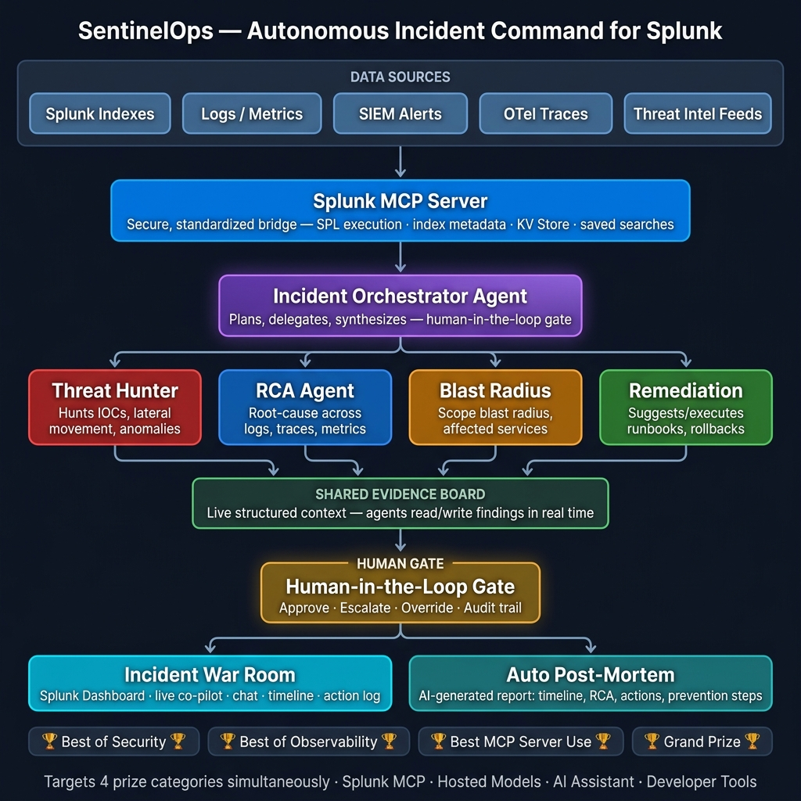

<p align="center">
  
</p>

<h1 align="center">🛡️ SentinelOps — Autonomous Incident Command for Splunk</h1>

<p align="center">
  <b>A multi-agent AI command system that launches the moment an alert fires,<br/>investigates in parallel through the Splunk MCP Server, and delivers a fully-reasoned<br/>incident package in under 3 minutes.</b>
</p>

<p align="center">
  
  
  
  
  
</p>

---

## 🏆 Hackathon Submission — Splunk Agentic AI Hackathon

**Track:** Security  
**Team:** SentinelOps  
**Hackathon:** [Splunk Agentic Ops Hackathon on Devpost](https://splunkagenticops.devpost.com/)

---

## 📋 Table of Contents

- [The Problem](#-the-problem)
- [Our Solution](#-our-solution)
- [Architecture](#-architecture)
- [Splunk AI Tool Usage](#-splunk-ai-tool-usage)
- [Agent System](#-agent-system)
- [War Room Dashboard](#-war-room-dashboard)
- [Setup & Installation](#-setup--installation)
- [Running the Application](#-running-the-application)
- [Demo Mode](#-demo-mode)
- [Live Splunk Mode](#-live-splunk-mode)
- [API Reference](#-api-reference)
- [Testing](#-testing)
- [Project Structure](#-project-structure)
- [Troubleshooting](#-troubleshooting)
- [License](#-license)

---

## 🔥 The Problem

Most teams responding to a critical incident waste the first **20–40 minutes** assembling context — jumping between dashboards, re-running SPL queries, paging the right people. This creates a dangerous gap between alert-fire and meaningful action.

**Key challenges:**
- ⏱️ **Slow triage:** Manual investigation across multiple Splunk views
- 🧩 **Context fragmentation:** Findings scattered across dashboards and tickets
- 🤝 **Coordination overhead:** Paging on-call teams and explaining context
- 📋 **Inconsistent quality:** Post-mortems are hand-written hours after resolution

---

## 💡 Our Solution

**SentinelOps** replaces that chaos with a **multi-agent command system** that activates the moment an alert fires. A network of 5 specialized AI agents — each with a focused role — works **in parallel** through the **Splunk MCP Server**, converges findings on a shared **Evidence Board**, and hands a human operator a fully-reasoned, scoped, and actioned incident package in **under 3 minutes**.

### What Makes It Agentic

SentinelOps goes beyond passive analysis. Each agent:
- **Autonomously decides** which SPL queries to generate using `saia_generate_spl`
- **Optimizes queries** before execution using `saia_optimize_spl`
- **Interprets results** in natural language using `saia_explain_spl`
- **Acts on findings** by writing to the shared Evidence Board
- **Requests human approval** only when executing high-risk remediation actions

The system doesn't just analyze — it **investigates, correlates, maps impact, plans remediation, and generates a complete post-mortem** without human prompting.

---

## 🏗️ Architecture

<p align="center">
  
</p>

### Architecture Overview

```
┌──────────────────────────────────────────────────────────────┐
│                    WAR ROOM DASHBOARD                        │
│  ┌──────────┐  ┌──────────────┐  ┌──────────────────────┐   │
│  │ Agent    │  │  Evidence    │  │  Recommendations     │   │
│  │ Status   │  │  Board      │  │  + Approval Gate      │   │
│  │ Panel    │  │  + Timeline  │  │  + Chat Interface     │   │
│  └──────────┘  └──────────────┘  └──────────────────────┘   │
│         ↕ WebSocket Real-time                                │
├──────────────────────────────────────────────────────────────┤
│                    FASTAPI BACKEND                            │
│  ┌────────────────────────────────────────────────────────┐  │
│  │              LangGraph Orchestration                   │  │
│  │  ┌──────────────────────────────────────────────────┐  │  │
│  │  │         orchestrator_decompose                   │  │  │
│  │  │              ↙    ↙    ↘    ↘                    │  │  │
│  │  │  ┌──────┐ ┌────┐ ┌──────┐ ┌───────────┐         │  │  │
│  │  │  │Threat│ │RCA │ │Blast │ │Remediation│  (fan-   │  │  │
│  │  │  │Hunter│ │    │ │Radius│ │           │   out)   │  │  │
│  │  │  └──┬───┘ └──┬─┘ └──┬───┘ └─────┬─────┘         │  │  │
│  │  │     ↘    ↘    ↙    ↙                             │  │  │
│  │  │         orchestrator_synthesize                   │  │  │
│  │  │              ↓                                    │  │  │
│  │  │     human_approval_gate (interrupt)               │  │  │
│  │  │              ↓                                    │  │  │
│  │  │     execute_approved_actions                      │  │  │
│  │  │              ↓                                    │  │  │
│  │  │     generate_postmortem → END                     │  │  │
│  │  └──────────────────────────────────────────────────┘  │  │
│  └────────────────────────────────────────────────────────┘  │
├──────────────────────────────────────────────────────────────┤
│              SPLUNK MCP SERVER + SAIA TOOLS                   │
│  ┌──────────────────┐    ┌──────────────────────────────┐    │
│  │  MCP Tools (5)   │    │  SAIA AI Tools (4)           │    │
│  │  splunk_run_query│    │  saia_generate_spl           │    │
│  │  splunk_get_*    │    │  saia_optimize_spl           │    │
│  │  splunk_run_*    │    │  saia_explain_spl            │    │
│  └──────────────────┘    │  saia_ask_splunk_question    │    │
│                          └──────────────────────────────┘    │
├──────────────────────────────────────────────────────────────┤
│              SPLUNK ENTERPRISE / CLOUD                        │
│  ┌──────────────┐ ┌──────────────┐ ┌──────────────────────┐ │
│  │sentinalops_os│ │sentinalops_  │ │ KV Store (Evidence   │ │
│  │ (linux_secure│ │ web (nginx   │ │  Board Persistence)  │ │
│  │  syslog, ps) │ │  access_log) │ │                      │ │
│  └──────────────┘ └──────────────┘ └──────────────────────┘ │
└──────────────────────────────────────────────────────────────┘
```

### Data Flow

1. **Alert fires** → Splunk ES sends webhook to `/api/webhook/alert`
2. **Orchestrator** decomposes the alert → discovers live indexes via `splunk_get_indexes` + `splunk_get_metadata`
3. **4 agents fan out in parallel**, each running the mandated pipeline:
   - `saia_generate_spl` → `saia_optimize_spl` → `splunk_run_query` → `saia_explain_spl`
4. **Agents converge** → Orchestrator synthesizes findings into an incident narrative
5. **Human-in-the-loop** → Operator reviews and approves remediation
6. **Post-mortem generated** → Complete markdown document with IOC tables, MITRE mapping, and prevention steps

---

## 🤖 Splunk AI Tool Usage

> **Every Splunk AI tool is demonstrably called and logged.** The War Room dashboard shows a live SAIA call counter.

### Mandated Tools Used

| # | Tool | Category | Usage in SentinelOps |
|---|------|----------|---------------------|
| 1 | `splunk_run_query` | MCP Server | Primary data access — every agent runs SPL against live indexes |
| 2 | `splunk_get_indexes` | MCP Server | Orchestrator discovers available data indexes on startup |
| 3 | `splunk_get_metadata` | MCP Server | Orchestrator discovers sourcetypes per index for context |
| 4 | `splunk_get_knowledge_objects` | MCP Server | RCA Agent fetches saved searches/alerts for correlation |
| 5 | `splunk_run_saved_search` | MCP Server (Beta) | RCA Agent runs existing correlation searches |
| 6 | `saia_generate_spl` | AI Assistant | **Core** — All agents use NL→SPL for dynamic query generation |
| 7 | `saia_optimize_spl` | AI Assistant | All agents optimize generated SPL before execution |
| 8 | `saia_explain_spl` | AI Assistant | All agents explain query results for operator transparency |
| 9 | `saia_ask_splunk_question` | AI Assistant | Remediation Agent + Chat interface for contextual advice |

### The SAIA Pipeline (Every Agent)

```
Natural Language Intent
        ↓
[saia_generate_spl] → SPL Query
        ↓
[saia_optimize_spl] → Optimized SPL
        ↓
[splunk_run_query]  → Raw Results
        ↓
[saia_explain_spl]  → Human-Readable Explanation
        ↓
Agent Finding (written to Evidence Board)
```

---

## 🕵️ Agent System

### 1. 🎯 Orchestrator (Incident Commander)

**Role:** Decomposes alerts and synthesizes final incident narrative.

- **On startup:** Calls `splunk_get_indexes` + `splunk_get_metadata` to discover live data
- **Decomposition:** Classifies alert type and dispatches sub-agents
- **Synthesis:** Merges all findings into severity assessment, MITRE mapping, and narrative
- **Tools used:** `splunk_get_indexes`, `splunk_get_metadata`, `saia_generate_spl`

### 2. 🔍 Threat Hunter (IOC & MITRE Analysis)

**Role:** Runs 6 parallel hunting pipelines to find indicators of compromise.

- **Hunts:** Failed auth, suspicious processes, successful logins after failures, outbound connections, privilege escalation, lateral movement
- **Each hunt** uses the full `saia_generate_spl` → `saia_optimize_spl` → `splunk_run_query` → `saia_explain_spl` pipeline
- **Output:** Structured `ThreatFinding` objects with IOC lists, confidence scores, and MITRE technique IDs

### 3. 🔬 RCA Agent (Root Cause Analysis)

**Role:** Identifies the root cause by correlating saved searches and building a causal chain.

- Discovers and runs existing saved searches via `splunk_get_knowledge_objects` + `splunk_run_saved_search`
- Generates timeline correlation SPL via `saia_generate_spl`
- **Output:** `RCAFinding` with root cause, confidence score, contributing factors, and causal chain

### 4. 💥 Blast Radius (Impact Mapping)

**Role:** Maps all affected entities — hosts, users, services, data stores.

- Generates dynamic blast radius queries via `saia_generate_spl`
- Uses `saia_ask_splunk_question` for contextual dependency mapping
- **Output:** `AffectedEntity` list with risk scores (compromised vs. potentially affected)

### 5. 🛠️ Remediation (Action Planning)

**Role:** Generates prioritized remediation actions with approval gates.

- Uses `saia_ask_splunk_question` for containment advice
- Retrieves runbooks from KV Store
- Generates verification SPL via `saia_generate_spl`
- **Output:** Sorted `RemediationAction` list with priorities, targets, and approval requirements

---

## 🖥️ War Room Dashboard

The glassmorphic dark-mode dashboard provides real-time incident visibility:

| Panel | Description |
|-------|-------------|
| **SAIA Counter** | Live count of SAIA calls, SPL queries, and saved searches (header bar) |
| **Agent Status** | Clickable cards for all 5 agents — click to see detailed findings |
| **Evidence Board** | Expandable cards with SAIA/MCP tool tags and severity badges |
| **Timeline** | Chronological attack chain with MITRE technique markers |
| **Recommendations** | Prioritized remediation actions with P1-P5 severity |
| **Execution Log** | Live log with `[SAIA:...]` and `[MCP:...]` tag highlighting |
| **Chat** | NL query interface powered by `saia_generate_spl` + `saia_ask_splunk_question` |
| **Post-Mortem** | Auto-generated markdown document with 10 sections |

### Agent Detail Modals

Click any agent card to see:
- **Threat Hunter:** Findings table, IOC list, SPL queries executed
- **RCA Agent:** Root cause, contributing factors, causal chain timeline
- **Blast Radius:** Affected hosts/users/services with risk scores
- **Remediation:** Action table with priorities, descriptions, and risk assessments
- **Orchestrator:** Incident narrative, data context, MITRE techniques

---

## ⚙️ Setup & Installation

### Prerequisites

- **Python 3.11+** (3.12 recommended)
- **Splunk Enterprise** or **Splunk Cloud** with MCP Server v1.1+  
  *OR* use **Demo Mode** (no Splunk needed — pre-baked responses)
- **Git**

### 1. Clone the Repository

```bash
git clone https://github.com/your-username/sentinelops.git
cd sentinelops
```

### 2. Create Virtual Environment

```bash
python -m venv venv

# Windows
venv\Scripts\activate

# macOS/Linux
source venv/bin/activate
```

### 3. Install Dependencies

```bash
pip install -r requirements.txt
```

### 4. Configure Environment

```bash
cp .env.example .env
```

Edit `.env` with your settings:

```dotenv
# For Demo Mode (no Splunk needed):
DEMO_MODE=true

# For Live Splunk:
DEMO_MODE=false
SPLUNK_HOST=https://your-splunk-instance
SPLUNK_PORT=8089
SPLUNK_TOKEN=your-bearer-token
SPLUNK_INDEX=sentinalops_os
```

### 5. (Optional) Setup Splunk Indexes

If using a live Splunk instance:

```bash
bash scripts/setup_splunk.sh
```

This creates the `sentinalops_os` and `sentinalops_web` indexes and configures data inputs.

---

## 🚀 Running the Application

### Start the Server

```bash
python -m backend.main
```

The server starts at **http://localhost:8000**

### Open the Dashboard

Navigate to **http://localhost:8000** in your browser.

### Trigger a Demo Incident

Click the **"🚀 Launch Incident Demo"** button on the welcome screen, or call the API:

```bash
curl -X POST http://localhost:8000/api/incident/trigger-demo
```

### Docker Deployment

```bash
# Full stack (backend + nginx + traffic generator)
docker-compose up -d

# With anomaly injector for live attack simulation
docker-compose --profile demo up anomaly-injector
```

---

## 🎮 Demo Mode

Demo mode provides a complete end-to-end experience **without a live Splunk instance**:

- **Pre-baked SAIA responses** — `saia_generate_spl` returns realistic SPL
- **Sample query results** — `splunk_run_query` returns BOTS v3-style results
- **Full agent pipeline** — All 5 agents run their complete workflow
- **Auto-approval** — Human gate auto-approves after 2 seconds
- **Post-mortem generation** — Complete 10-section markdown document

To enable: Set `DEMO_MODE=true` in `.env`

### Demo Scenario

The built-in scenario simulates a **credential stuffing attack** escalating to **lateral movement**:

1. 🔴 47 failed login attempts from `40.80.148.42`
2. 🔴 `svc_admin` account compromised
3. ⚡ PsExec lateral movement to `we8105desk`
4. ⚡ Privilege escalation — `j.smith` added to Domain Admins
5. ⚡ RDP lateral movement to `we9041srv`
6. 🌐 C2 communication to `hildegardsfarm.com`
7. 💾 Data staging — 842MB archive created
8. ⏰ Persistence via scheduled task

---

## 🔧 Live Splunk Mode

### Required Splunk Components

| Component | Version | Purpose |
|-----------|---------|---------|
| Splunk Enterprise / Cloud | 9.x+ | Data platform |
| Splunk MCP Server | v1.1+ | AI tool bridge |
| Splunk AI Assistant | Latest | NL→SPL, Explain, Optimize |

### Splunk Configuration

1. **Enable MCP Server** in your Splunk instance
2. **Create indexes:** `sentinalops_os`, `sentinalops_web`
3. **Generate attack logs:** `python demo/anomaly_injector.py --output /var/log/sentinalops/attack.log`
4. **Configure data inputs** to monitor the log files
5. **Set** `DEMO_MODE=false` in `.env`

### Anomaly Injector

Generate realistic attack traffic for live demos:

```bash
# Credential stuffing + lateral movement (to stdout)
python demo/anomaly_injector.py --type all --count 200

# Write to a monitored log file
python demo/anomaly_injector.py --output /var/log/sentinalops/attack.log --type all
```

---

## 📡 API Reference

### REST Endpoints

| Method | Endpoint | Description |
|--------|----------|-------------|
| `GET` | `/` | War Room Dashboard |
| `POST` | `/api/webhook/alert` | Receive Splunk ES alert webhook |
| `POST` | `/api/incident/trigger-demo` | Trigger demo scenario |
| `GET` | `/api/incident/{id}/status` | Get incident state + evidence |
| `POST` | `/api/incident/{id}/approve` | Submit human approval decision |
| `POST` | `/api/incident/{id}/chat` | Contextual chat (incident-scoped) |
| `POST` | `/api/chat` | Global chat with SAIA tools |
| `GET` | `/api/incident/{id}/postmortem` | Get generated post-mortem |
| `GET` | `/api/health` | System health check |

### WebSocket

| Endpoint | Description |
|----------|-------------|
| `ws://host/ws` | Global real-time event stream |
| `ws://host/ws/incident/{id}` | Incident-scoped event stream |

**Event types:** `agent_status`, `evidence_update`, `log_entry`, `counter_update`, `incident_complete`, `heartbeat`

### Webhook Payload (Splunk ES)

```json
{
  "alert_id": "ALERT-2025-0847",
  "alert_name": "Credential Stuffing Detection",
  "alert_severity": "high",
  "alert_raw": {
    "source_ip": "40.80.148.42",
    "failed_count": 47,
    "success_count": 3,
    "targeted_accounts": ["svc_admin", "j.smith"]
  }
}
```

---

## 🧪 Testing

### MCP Tool Verification

Verify all 9 mandated Splunk AI tools:

```bash
# Demo mode (no Splunk needed)
python test_mcp_tools.py

# Live Splunk instance
python test_mcp_tools.py --live
```

**Expected output:**

```
  SentinelOps — MCP Tool Verification
  Mode: DEMO

1️⃣  Testing splunk_get_indexes...    ✅ PASS
2️⃣  Testing splunk_get_metadata...   ✅ PASS
3️⃣  Testing splunk_run_query...      ✅ PASS
4️⃣  Testing splunk_get_knowledge_objects... ✅ PASS
5️⃣  Testing splunk_run_saved_search... ✅ PASS
6️⃣  Testing saia_generate_spl...     ✅ PASS
7️⃣  Testing saia_explain_spl...      ✅ PASS
8️⃣  Testing saia_optimize_spl...     ✅ PASS
9️⃣  Testing saia_ask_splunk_question... ✅ PASS

  RESULTS: 9/9 tools PASSED
```

---

## 📁 Project Structure

```
sentinelops/
├── README.md                    # This file
├── requirements.txt             # Python dependencies
├── .env.example                 # Environment template
├── docker-compose.yml           # Full-stack deployment
├── Dockerfile                   # Backend container
├── test_mcp_tools.py            # MCP tool verification script
├── architecture.png             # Architecture diagram
│
├── backend/                     # FastAPI + LangGraph backend
│   ├── main.py                  # Server entry point, REST API, WebSocket
│   ├── config.py                # Pydantic settings from .env
│   │
│   ├── agents/                  # LangGraph multi-agent system
│   │   ├── state.py             # IncidentState TypedDict + data classes
│   │   ├── graph.py             # LangGraph workflow definition
│   │   ├── orchestrator.py      # Decompose + Synthesize nodes
│   │   ├── threat_hunter.py     # 6 parallel hunting pipelines
│   │   ├── rca_agent.py         # Root cause + causal chain
│   │   ├── blast_radius.py      # Impact mapping
│   │   └── remediation.py       # Action planning + runbooks
│   │
│   ├── splunk_mcp/              # Splunk MCP Server client
│   │   ├── client.py            # Async MCP/SAIA tool wrapper (9 tools)
│   │   ├── kv_store.py          # KV Store operations + runbooks
│   │   └── spl_library.py       # Parameterized SPL query registry
│   │
│   ├── evidence/                # Evidence Board
│   │   └── board.py             # Thread-safe singleton + WebSocket broadcast
│   │
│   ├── postmortem/              # Auto post-mortem generation
│   │   └── generator.py         # 10-section markdown generator
│   │
│   └── demo/                    # Demo mode support
│       ├── scenario.py          # BOTS v3 attack scenario + MITRE mapping
│       └── sample_data.py       # Pre-baked SPL query results
│
├── frontend/                    # War Room Dashboard
│   ├── index.html               # Main HTML structure
│   ├── css/
│   │   └── styles.css           # Glassmorphic dark theme
│   └── js/
│       ├── app.js               # Main controller + SAIA counter
│       ├── websocket.js         # WebSocket manager + auto-reconnect
│       ├── agent-status.js      # Agent card status updates
│       ├── evidence-board.js    # Expandable evidence cards
│       ├── timeline.js          # Attack timeline renderer
│       ├── chat.js              # NL chat interface
│       └── postmortem.js        # Markdown renderer for post-mortem
│
├── demo/                        # Demo utilities
│   └── anomaly_injector.py      # Generates attack log entries
│
├── nginx/                       # Nginx config for traffic generation
│   ├── nginx.conf
│   └── html/index.html
│
└── scripts/                     # Setup scripts
    └── setup_splunk.sh          # Splunk index + input configuration
```

---

## 🛠️ Troubleshooting

### Common Issues

| Issue | Solution |
|-------|----------|
| `ModuleNotFoundError: langgraph` | Run `pip install -r requirements.txt` |
| WebSocket disconnects | Check that CORS is enabled; the server auto-reconnects |
| `No indexes returned` | Ensure Splunk MCP Server is running, or use `DEMO_MODE=true` |
| Agent graph error | Check terminal logs — errors include full tracebacks |
| Empty post-mortem | Wait for all agents to complete before viewing |
| SAIA counter stays at 0 | Ensure the incident was triggered and agents are running |

### Logs

```bash
# Server logs include SAIA/MCP tool call tracking:
2025-08-20 14:32:00 | sentinelops.mcp | [SAIA:saia_generate_spl] (demo) 'find failed login...' → SPL generated
2025-08-20 14:32:01 | sentinelops.mcp | [MCP:splunk_run_query] (demo) index=sentinalops_os... → 4 results
```

---

## 🏗️ Built With

| Technology | Purpose |
|-----------|---------|
| [Splunk MCP Server v1.1](https://splunk.com) | AI tool bridge for Splunk data |
| [Splunk AI Assistant](https://splunk.com) | NL→SPL, Explain, Optimize |
| [LangGraph](https://github.com/langchain-ai/langgraph) | Multi-agent orchestration with parallel fan-out |
| [FastAPI](https://fastapi.tiangolo.com/) | Async REST API + WebSocket server |
| [Python 3.12](https://python.org) | Runtime |
| [Docker](https://docker.com) | Container deployment |

---

## 📜 License

This project is licensed under the **MIT License** — see the [LICENSE](LICENSE) file for details.

---

<p align="center">
  <b>SentinelOps — Turning alert chaos into autonomous command.</b><br/>
  <sub>Built for the Splunk Agentic AI Hackathon 2025</sub>
</p>
