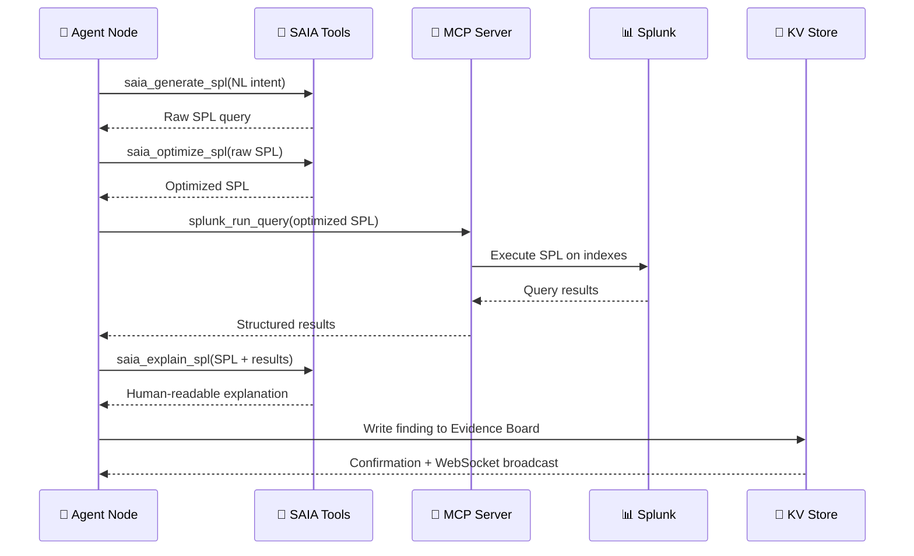

# 🏗️ SentinelOps — Architecture Diagram

> **Mermaid.js rendering of the complete SentinelOps data flow.**
> Covers all three hackathon tracks: Security, Observability, and Platform.

## System Architecture

```mermaid
graph TB
    subgraph TRIGGER["🔔 Alert Trigger Layer"]
        WEBHOOK["Splunk ES Webhook<br/>/api/webhook/alert"]
        DEMO_BTN["Dashboard Demo Button<br/>/api/incident/trigger-demo"]
    end

    subgraph LANGGRAPH["🧠 LangGraph Orchestration Engine"]
        DECOMPOSE["orchestrator_decompose<br/>Alert classification & index discovery"]

        subgraph AGENTS["⚡ Parallel Agent Fan-Out"]
            direction LR
            THREAT["🔍 Threat Hunter<br/>6 hunting pipelines<br/>IOC extraction"]
            RCA["🔬 RCA Agent<br/>Root cause analysis<br/>Causal chain"]
            BLAST["💥 Blast Radius<br/>Impact mapping<br/>service_topology.csv"]
            REMED["🛠️ Remediation<br/>Action planning<br/>Runbook retrieval"]
        end

        SYNTHESIZE["orchestrator_synthesize<br/>Merge findings → incident narrative"]
        HUMAN_GATE["🚦 Human Approval Gate<br/>LangGraph interrupt()"]
        EXECUTE["⚙️ execute_approved_actions"]
        POSTMORTEM["📋 generate_postmortem<br/>10-section markdown doc"]
    end

    subgraph MCP_SERVER["🔌 Splunk MCP Server v1.1"]
        MCP_TOOLS["MCP Tools<br/>splunk_run_query<br/>splunk_get_indexes<br/>splunk_get_metadata<br/>splunk_get_knowledge_objects<br/>splunk_run_saved_search"]
        SAIA_TOOLS["SAIA AI Tools<br/>saia_generate_spl<br/>saia_optimize_spl<br/>saia_explain_spl<br/>saia_ask_splunk_question"]
    end

    subgraph KV_STORE["💾 KV Store Memory State"]
        EVIDENCE["Evidence Board<br/>Thread-safe singleton"]
        RUNBOOKS["Remediation Runbooks"]
        COUNTERS["SAIA Call Counters"]
        AGENT_STATE["Agent Status Tracking"]
    end

    subgraph SPLUNK_DATA["📊 Splunk Enterprise / Cloud"]
        BOTS["BOTS v3 Dataset<br/>sentinalops_os index"]
        WEB_IDX["sentinalops_web index<br/>nginx access logs"]
        TOPOLOGY["service_topology.csv<br/>MCP lookup for blast radius"]
    end

    subgraph DASHBOARD["🖥️ Splunk Dashboard Studio UI"]
        WAR_ROOM["War Room Dashboard<br/>Glassmorphic dark-mode"]
        WS_STREAM["WebSocket Real-time Stream<br/>Agent status · Evidence · Logs"]
        CHAT["NL Chat Interface<br/>saia_generate_spl powered"]
        PM_VIEW["Post-Mortem Viewer<br/>Markdown renderer"]
        AI_WATCHDOG["AI Watchdog Panel<br/>Splunk MCP TA · AI traffic"]
    end

    %% Trigger → LangGraph
    WEBHOOK -->|"POST JSON alert payload"| DECOMPOSE
    DEMO_BTN -->|"BOTS v3 demo scenario"| DECOMPOSE

    %% Decompose → Parallel Agents
    DECOMPOSE -->|"fan-out"| THREAT
    DECOMPOSE -->|"fan-out"| RCA
    DECOMPOSE -->|"fan-out"| BLAST
    DECOMPOSE -->|"fan-out"| REMED

    %% Agents → Synthesize (fan-in)
    THREAT -->|"ThreatFindings"| SYNTHESIZE
    RCA -->|"RCAFindings"| SYNTHESIZE
    BLAST -->|"AffectedEntities"| SYNTHESIZE
    REMED -->|"RemediationActions"| SYNTHESIZE

    %% Synthesize → Human Gate → Execute → Postmortem
    SYNTHESIZE --> HUMAN_GATE
    HUMAN_GATE -->|"approved / modified"| EXECUTE
    HUMAN_GATE -->|"escalated"| POSTMORTEM
    EXECUTE --> POSTMORTEM

    %% Agents ↔ MCP Server (SAIA pipeline)
    THREAT <-->|"saia_generate_spl → saia_optimize_spl → splunk_run_query → saia_explain_spl"| MCP_TOOLS
    THREAT <-->|"NL→SPL pipeline"| SAIA_TOOLS
    RCA <-->|"splunk_get_knowledge_objects + splunk_run_saved_search"| MCP_TOOLS
    RCA <-->|"saia_generate_spl"| SAIA_TOOLS
    BLAST <-->|"Dynamic blast radius queries"| MCP_TOOLS
    BLAST <-->|"saia_generate_spl + saia_explain_spl"| SAIA_TOOLS
    REMED <-->|"saia_ask_splunk_question"| SAIA_TOOLS

    %% MCP Server ↔ Splunk Data
    MCP_TOOLS <-->|"SPL execution"| BOTS
    MCP_TOOLS <-->|"Web log queries"| WEB_IDX
    MCP_TOOLS <-->|"Lookup table"| TOPOLOGY

    %% Agents ↔ KV Store
    THREAT -->|"Write findings"| EVIDENCE
    RCA -->|"Write findings"| EVIDENCE
    BLAST -->|"Write entities"| EVIDENCE
    REMED -->|"Read runbooks"| RUNBOOKS
    REMED -->|"Write actions"| EVIDENCE

    %% KV Store ↔ Dashboard
    EVIDENCE -->|"WebSocket broadcast"| WS_STREAM
    COUNTERS -->|"Live SAIA counter"| WAR_ROOM
    AGENT_STATE -->|"Agent card updates"| WAR_ROOM

    %% Dashboard components
    WS_STREAM --> WAR_ROOM
    POSTMORTEM -->|"Markdown doc"| PM_VIEW

    %% Styling
    classDef trigger fill:#ef4444,stroke:#dc2626,color:#fff
    classDef agent fill:#3b82f6,stroke:#2563eb,color:#fff
    classDef mcp fill:#8b5cf6,stroke:#7c3aed,color:#fff
    classDef kv fill:#f59e0b,stroke:#d97706,color:#000
    classDef splunk fill:#10b981,stroke:#059669,color:#fff
    classDef dash fill:#06b6d4,stroke:#0891b2,color:#fff
    classDef gate fill:#f97316,stroke:#ea580c,color:#fff

    class WEBHOOK,DEMO_BTN trigger
    class THREAT,RCA,BLAST,REMED agent
    class MCP_TOOLS,SAIA_TOOLS mcp
    class EVIDENCE,RUNBOOKS,COUNTERS,AGENT_STATE kv
    class BOTS,WEB_IDX,TOPOLOGY splunk
    class WAR_ROOM,WS_STREAM,CHAT,PM_VIEW,AI_WATCHDOG dash
    class HUMAN_GATE gate
```

## SAIA Pipeline (Per Agent)

## Hackathon Track Coverage

| Track | Implementation | Key Components |
|-------|---------------|----------------|
| **🔴 Security** | BOTS v3 dataset processing via Splunk MCP Server | Threat Hunter (6 pipelines), IOC extraction, MITRE ATT&CK mapping |
| **🟢 Observability** | `service_topology.csv` via MCP lookup → blast radius + business impact | Blast Radius agent, downstream dependency mapping, risk scoring |
| **🔵 Platform** | Splunk MCP TA queries for AI traffic tracking | AI Watchdog dashboard, SAIA call counters, SPL query audit trail |
